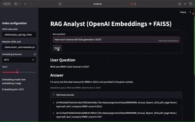

# RAGAnalyst

RAG specializing in the analysis of Annual Reports within the automotive sector



## Follow-up aware RAG with query expansion for diverse Top-K retrieval

### Problem

- Annual report questions often appear as follow-ups and depend on chat history.
- Users use different phrasings (“profits”, “net income”, “operating margin”).
- A single literal query can miss relevant chunks across companies and years.

### Goals

- Normalize follow-up questions into standalone queries (rewrite_question).
- Expand each query into multiple variants (expand_queries) to capture synonyms, company names, and years.
- Diversify Top-K by balancing results per company while keeping best-scoring chunks.

### Features

1. rewrite_question
   - Converts follow-ups into standalone queries using conversation context.
   - Outcome: clear, self-contained query for consistent retrieval.

2. expand_queries
   - Generates 6–10 short variants:
     - Metric synonyms: revenue, net sales, net income, profit, EBIT, EBITDA, operating margin, return on sales.
     - Companies from metadata: Tesla, BMW, Ford.
     - Year hints: 2017, 2020–2023.
   - Embeds each variant, merges hits, and deduplicates IDs for robust coverage.

3. Company-balanced Top-K
   - Pools candidates per company and selects best chunks in rounds.
   - Ensures multi-company questions don’t collapse to one issuer; fills remaining slots by global score.

### How it meets the functional requirements

- Point questions: “BMW’s total revenue in 2023?”, “Tesla revenue in 2023?”
  - Rewriting + revenue synonyms catch “net sales” sections.
- Year-specific: “Ford revenue 2020?”, “BMW revenue 2017?”
  - Year extraction biases selection and filters sources containing the target year.
- Qualitative: “Economic factors for Ford in 2021?”
  - Expansion includes macro terms to surface MD&A sections.
- Product-stage: “Tesla product in development?”
  - Variants around “development”, “pipeline”, “R&D”, “roadmap” retrieve product strategy pages.
- Profit comparisons: “BMW profits 2020 and 2023?”, “Who had higher profits in 2022?”
  - Synonyms (net income, operating profit, EBIT, EBITDA) ensure relevant numeric sections; company-balanced selection yields comparable chunks.
- Multi-company summaries: “Revenue for Tesla, BMW, Ford over past three years.”
  - Expansion over companies and years increases coverage; balancing enforces diversity.
- Trends: “BMW growth trends 2020–2023.”
  - Variants include growth/YoY/CAGR/profitability to surface MD&A and KPI tables.

### Behavioral summary

- For each input:
  - Rewrite to standalone if follow-up.
  - Expand into targeted variants (company + year + metric synonyms).
  - Embed, search FAISS, combine results, dedupe, and balance per company.
  - Pass Top-K chunks to the generator (OpenAI or HF) for grounded answers.

### Benefits

- Higher recall via targeted expansion without sacrificing precision.
- Better multi-issuer coverage through company-balanced selection.
- Robust handling of conversational follow-ups.
- Improved answers for metric- and year-specific questions.

### Usage notes

- Use the index built with the same embedder as runtime; do not mix HF-embedded indexes with OpenAI query embeddings and vice versa.
- The Hybrid app uses HF embeddings for retrieval with OpenAI for rewriting/answering.

Setup

```bash
pip install pymupdf pdfplumber pdf2image pytesseract sentence-transformers faiss-cpu python-magic
```

You also need Tesseract OCR installed on your machine (for Linux/macOS via package manager or Windows installer).

Example:

macOS (Homebrew): ```brew install tesseract```

Ubuntu: ```sudo apt install tesseract-ocr```

## Prepare and persist embedding vectors

Hugging Face embeddings (SentenceTransformers), combined index:
  
```bash
python ./src/prep_embed_hf.py data/assignment/Data --output_dir data/vector --combine
```

Outputs under `data/vector/`:

- `rag_index.index`,
- `rag_index.ids.json`
- `metadata.jsonl`
- `embeddings.npy`
- `images.json`
- extracted images: `data/vector/extracted_images/...`

OpenAI embeddings (text-embedding-3-large), combined index:
  
```bash
export OPENAI_API_KEY=<your_key>
python ./src/prep_embed_oai.py data/assignment/Data --outdir data/vector_oai
```

Outputs under `data/vector_oai/`:

- `rag_index.index`,
- `rag_index.ids.json`
- `metadata.jsonl`
- `embeddings.npy`
- `images.json`
- `manifest.json` (records embedding model/dim)

## Setup Docker build and run

Build (on macOS; add --platform if on Apple Silicon to get faiss-cpu wheels):

```bash
docker build -t raganalyst:latest -f dockerfile .
```

Apple Silicon note: ```docker build --platform=linux/amd64 -t raganalyst:latest -f dockerfile .```

Run the OpenAI app (app_oai.py):

```bash
docker run --rm -p 8501:8501 -e OPENAI_API_KEY=sk-... -v "$(pwd)/data:/app/data" raganalyst:latest bash -lc "streamlit run src/app_oai.py port=8501"
```

Run the local HF app (app_hf.py):

```bash
docker run --rm -p 8501:8501 -e HUGGINGFACE_HUB_TOKEN=hf_XXXXXXXXXXXXXXXX -v "$(pwd)/.cache:/root/.cache/huggingface" -v "$(pwd)/data:/app/data" raganalyst:latest bash -lc "streamlit run src/app_hf.py port=8501"
```

Run the Hybrid (Local Embedding + OpenAI (GPT-4o) LLMs) app:

```bash
docker run --rm -p 8501:8501 \
  -e OPENAI_API_KEY=sk_... \
  -v "$(pwd)/data:/app/data" \
  raganalyst:latest \
  bash -lc "streamlit run src/app_hybrid.py --server.address=0.0.0.0 --server.port=8501"
```

Notes:

Mount your data directory so FAISS/metadata paths like ./data/vector_oai/... work inside the container at /app/data.
For the HF app, the model will download on first run. To persist the cache, mount a cache volume:
-v "$(pwd)/.cache:/root/.cache/huggingface"
If the HF model is large and you’re on Apple Silicon, keep --platform=linux/amd64 for build/run to ensure compatible wheels for faiss-cpu.
